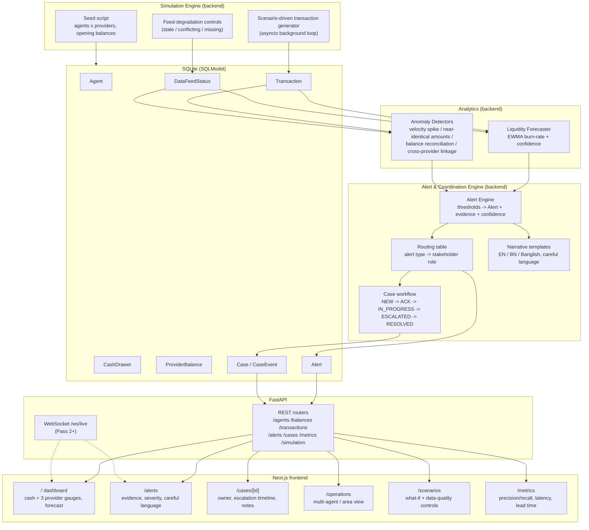
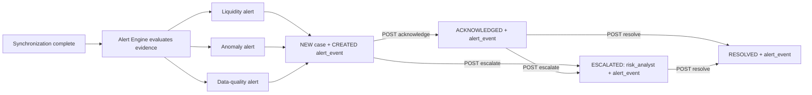

# Super Agent — Multi-Provider MFS Liquidity & Coordination Platform

A decision-support platform for multi-provider Mobile Financial Services (MFS) super-agent outlets. It gives an agent who serves bKash, Nagad, and Rocket customers out of one shared cash drawer a single view of liquidity across all three providers, forecasts cash shortages before they happen, flags unusual transaction activity with evidence, and routes alerts into human-owned cases so nothing important falls through the cracks.

All balances and transactions in this build are **simulated** for demo purposes. The app never connects to a real wallet or provider API, and it never labels a customer or transaction as fraud — only "unusual, here's why, here's who should look at it."

---

## Table of contents

- [The idea, explained simply](#the-idea-explained-simply)
- [Quickstart](#quickstart)
- [Demo flow](#demo-flow)
- [Architecture](#architecture)
- [API reference](#api-reference)
- [Data simulation & scenarios](#data-simulation--scenarios)
- [What-if simulator](#what-if-simulator)
- [Alert engine](#alert-engine)
- [Offline anomaly evaluation](#offline-anomaly-evaluation)
- [Demo login credentials](#demo-login-credentials)
- [Deployment guide (Docker Compose stack)](#deployment-guide-docker-compose-stack)
- [SonarQube & CI code analysis](#sonarqube--ci-code-analysis)
- [Assumptions and validation notes](#assumptions-and-validation-notes)

---

## The idea, explained simply

*A knowledge-transfer summary for anyone joining the project — teammates, stakeholders, or future you. No prior context assumed. (Full version: [`EXPLAINER.md`](EXPLAINER.md))*

Picture an agent's shop counter in a busy market, the afternoon before Eid. The shop serves customers of three mobile-money providers — bKash, Nagad, Rocket. The agent has:

- **One physical cash drawer** (real taka, shared across all three providers).
- **Three separate phone-wallet balances** — one e-money account per provider, kept completely apart (bKash's app can't see Nagad's numbers, and vice versa).

Money moves in two directions:

- **Cash-out** (a customer wants cash): the customer sends e-money to the agent, the agent hands over cash. Cash drawer goes **down**, that provider's e-money balance goes **up**.
- **Cash-in** (a customer wants to top up their wallet): the customer hands the agent cash, the agent sends e-money to the customer. Cash drawer goes **up**, that provider's e-money balance goes **down**.

Right before Eid, almost everyone wants cash-out, so the agent's cash drawer drains fast — even though, on paper, the agent looks "rich" if you add up cash plus all three e-money balances. Nobody is doing that addition, and nobody is looking ahead to say "you'll run out of cash by 5pm" or "bKash specifically is about to stall, not Nagad or Rocket." On top of that, a flood of similar-looking cash-out requests from a handful of accounts starts coming in — is that normal Eid demand, a data-feed glitch, or something that deserves a closer look? And once it deserves a closer look, who actually looks at it, and how do we know it got handled?

### What we're building

1. **A unified dashboard** — one screen showing the cash drawer and all three provider balances side by side, plus a plain-language forecast: *"At the current pace, bKash cash-out may stall around 5:20 PM. Confidence: medium."* No merging of the actual wallets — just three separate numbers shown together, doing the arithmetic a human would eventually do anyway, faster and continuously.
2. **An alarm system (explainable, not a black box)** — rolling averages, z-scores, and simple thresholds watch the transaction stream and raise flags:
   - *Liquidity flag*: cash (or one provider's balance) is trending toward zero, with a time estimate and confidence.
   - *Anomaly flag*: an unusual burst of near-identical transactions from a small group of accounts, with the actual transactions that triggered it.

   Every flag says **"unusual" / "requires review"** — never "this is fraud." The system hands over evidence; a human makes the call. This is a hard rule baked into every template and code path, not a disclaimer bolted on afterward.
3. **A coordination checklist** — when something important is flagged, it becomes a **case**: who was notified, who owns it, what they should do next, and whether it's acknowledged / in progress / escalated / resolved.

### Why the multi-provider view is more than a UI convenience

The genuinely new insight only shows up when you can see *across* providers at once. Example: a small group of accounts does near-identical cash-outs on bKash, and — within the same few minutes, at the same shop — a similar pattern shows up on Nagad. Individually, each provider's ops team sees a normal-ish blip on their own side. Only a view that sits across both providers, at the same physical agent, can connect those two blips into one pattern worth a second look.

### What the system deliberately never does

- Never merges the three providers' balances into one pot, or implies money can move between them.
- Never touches a real wallet, account, or transaction — everything is simulated/synthetic data.
- Never declares "this is fraud" — only "unusual, here's why, here's who should look at it."
- Never blocks a user, freezes funds, or takes an automatic financial action.
- Never asks for PINs, OTPs, passwords, or real customer identities.

### How it's built, in one paragraph

A FastAPI backend simulates the agent's transaction stream (cash drawer + 3 provider balances), runs the forecasting and anomaly-detection math, and turns important findings into alerts that are automatically routed to the right role and tracked as cases with an audit trail. A Next.js frontend shows all of this as a dashboard, an alert list with evidence, and a case-tracking view, with English/Bengali/Banglish explanations. No external AI API is called — the "AI/analytics" requirement is met by the statistical detectors themselves (EWMA forecasting, z-score anomaly detection), which keeps the whole thing explainable, testable, and safe to demo without an internet dependency.

---

## Quickstart

### Backend

```bash
cd backend
python -m venv .venv
.venv\Scripts\activate
pip install -r requirements.txt
uvicorn app.main:app --reload
```

The API starts on `http://localhost:8000`, creates `sust_hackathon.db` if needed, seeds the demo data on startup, and starts the background simulator.

Run backend tests:

```bash
cd backend
python -m pytest app/tests
```

### Frontend

```bash
cd frontend
npm install
npm run dev
```

The Next.js app runs on `http://localhost:3000` and expects the backend at `http://localhost:8000`. To point it elsewhere, create `frontend/.env.local` with:

```bash
NEXT_PUBLIC_API_BASE_URL=http://localhost:8000
```

Build check:

```bash
cd frontend
npm run build
```

> This single-process backend (SQLite, no Docker) is the current default and what the frontend talks to today. A separate, not-yet-feature-complete Docker Compose stack also exists in `backend/` — see [Deployment guide](#deployment-guide-docker-compose-stack) below.

---

## Demo flow

1. Open the dashboard and select a demo agent.
2. Watch the shared cash reserve, provider balances, shortage forecasts, and recent transactions update by polling the API.
3. Open Alerts & Cases to review liquidity, anomaly, or data-quality alerts.
4. Expand an alert to inspect evidence, confidence, routing owner, recommended next step, and case history.
5. Use case actions to acknowledge, start work, escalate, or resolve the advisory case.
6. Trigger safe fallback with `POST /simulation/degrade-feed` and confirm the UI/API show delayed feed status and low-confidence data quality.

---

## Architecture

*Full source: [`docs/ARCHITECTURE.md`](docs/ARCHITECTURE.md)*



### Component notes

- **Provider boundary**: `ProviderBalance` rows are keyed by `(agent_id, provider_id)` and are never summed into a single "combined wallet" value in storage — only displayed side by side. No code path converts or transfers value between providers.
- **Validation & metrics**: the `/metrics` endpoint reports proxy metrics for sync latency, forecast lead time, anomaly precision/recall, alert explanation coverage, and per-provider sync health so the demo can show operational evidence without pretending to be a production observability stack.
- **Simulation Engine**: the only source of transactions/balances (no real provider APIs are called, per challenge constraints). Scenario presets (A–D) are parameter sets fed into the same generator, not special-cased code paths — this keeps the demo and the "real" logic identical.
- **Analytics**: pure functions over `Transaction`/`ProviderBalance`/`DataFeedStatus` history — deterministic, unit-testable, no external calls. This is what satisfies the "use AI/analytics meaningfully" requirement without any LLM dependency.
- **Alert & Coordination Engine**: the only place that writes `Alert`/`Case`/`CaseEvent` rows. Routing table is a static, documented mapping (alert type → stakeholder role) — explicit and auditable rather than implicit.
- **Narrative templates**: parameterized strings per alert type/language, filled with evidence values computed upstream — templates never invent evidence, they only phrase it.
- **API layer**: stateless REST + a WebSocket fan-out for live updates; all endpoints read from the same DB the analytics/alert engines write to, so the frontend never talks to the simulation directly.
- **Frontend**: role-oriented pages (agent dashboard, ops/coordination views) rather than one generic table.
- **Auth**: backed by a `User` table (`backend/app/models/models.py`) and JWT bearer tokens (`backend/app/core/security.py`, `backend/app/core/deps.py`), issued via `POST /auth/login`. Accounts are predetermined/seeded only (`backend/app/simulation/seed.py`) — no self-registration and no customer login. Every API route (except `/`, `/health`, `/auth/login`) requires a valid token, and each role's data/case-mutation access is scoped server-side (see [Demo login credentials](#demo-login-credentials)).

### Provider boundary & real-world integration limits

This prototype represents bKash/Nagad/Rocket as three logically separate simulated systems sharing one physical cash observation point. It does not integrate with, authenticate against, or move value through any real provider API. "Unified view" means *read-side aggregation for display and analytics only* — never a merged balance, shared ledger, or cross-provider settlement. This boundary is enforced at the data model level (separate `ProviderBalance` rows, no cross-provider transfer operation exists in the codebase).

---

## API reference

*Full source: [`docs/API.md`](docs/API.md)*

### Core endpoints

| Endpoint | Purpose |
|---|---|
| `GET /health` | Liveness probe |
| `GET /agents` | List simulated agents |
| `GET /agents/{agent_id}/balances` | Per-agent shared cash plus per-provider balances |
| `GET /agents/{agent_id}/forecast` | Liquidity forecasts for the shared cash reserve and each provider |
| `GET /agents/{agent_id}/transactions` | Recent transactions, optionally filtered by provider |
| `GET /aggregate/forecast` | Combined forecast view for every agent and every provider |
| `GET /alerts` | Alert feed with optional agent/provider/category filters |
| `POST /alerts/{alert_id}/acknowledge` | Acknowledge an alert and advance the related case |
| `POST /alerts/{alert_id}/escalate` | Escalate an alert and update the case owner |
| `POST /alerts/{alert_id}/resolve` | Resolve the alert and related case |
| `GET /cases/{case_id}` / `PATCH /cases/{case_id}` | Read/update a case |
| `GET /metrics` | Operational proxy metrics for the demo |
| `POST /simulation/seed` | Reseed the simulator data |
| `POST /simulation/reset` | Reset the simulation state |
| `POST /simulation/degrade-feed` | Freeze a provider feed for demonstration purposes |
| `POST /simulate/scenario` | Run a named what-if scenario |

### `/metrics` payload

- `sync_latency` — placeholder proxy for feed synchronization delay.
- `forecast_lead_time` — placeholder proxy for how soon the forecast can issue a warning.
- `anomaly_precision` — precision of the anomaly detector against synthetic labels.
- `recall` — recall of the anomaly detector against synthetic labels.
- `false_positive_rate` — false-positive rate of the anomaly detector against synthetic labels.
- `alert_explanation_coverage` — proportion of alerts with both English and Bangla explanations.
- `provider_sync_health` — per-provider summary of configured feeds and tracked balances.

---

## Data simulation & scenarios

*Full source: [`docs/DATA_SIMULATION.md`](docs/DATA_SIMULATION.md)*

This prototype uses fully synthetic data. It does not ingest real bKash, Nagad, Rocket, agent, customer, wallet, or settlement data.

### Seed data

On backend startup, `app.main` initializes SQLite and seeds demo rows if no agents exist. `POST /simulation/seed` is an idempotent manual seed endpoint, and `POST /simulation/reset` clears the demo tables and reseeds a clean run.

Seeded entities:

- **Providers**: bKash, Nagad, Rocket, each with a display color.
- **Agents**: demo outlets with area labels.
- **Cash drawer**: one shared physical-cash balance per agent.
- **Provider balances**: one separate e-money balance per agent/provider pair.
- **Feed status**: one freshness row per agent/provider pair.

Provider balances are intentionally not merged. A unified view can display all balances side by side, but the app keeps each provider ledger separate.

### Transaction rules

Every generated transaction is either `CASH_OUT` or `CASH_IN`.

- `CASH_OUT`: the shared cash drawer decreases and that provider's e-money balance increases.
- `CASH_IN`: the shared cash drawer increases and that provider's e-money balance decreases.

If the outlet does not have enough cash for a cash-out, or enough provider e-money for a cash-in, the simulated transaction is recorded as `FAILED` and no balance is changed. Failed transactions are shown in the ticker but excluded from forecasting and anomaly baselines.

### Scenario A: Eid rush liquidity pressure

The background simulator runs every few seconds and uses agent profiles to create heavier cash-out demand than normal. This drives a visible drop in the shared cash reserve and gives the EWMA-style forecaster enough recent data to project a time-to-threshold.

The forecast output includes: target balance (`CASH` or a provider id), current balance, burn rate per minute, projected shortage time, confidence bucket, confidence note, and top provider contributors for cash pressure. The API and UI use careful wording such as "may run out" and "requires review" rather than treating a forecast as a final decision.

### Scenario B: Velocity spike

Some agent profiles occasionally inject a burst of cash-outs for one provider. The velocity detector compares the current rolling window against the same agent/provider's recent baseline, emitting evidence such as window count, baseline mean, standard deviation, z-score, unique customer count, amount range, and sample transaction ids.

The alert language intentionally says "unusual activity" and "requires review"; it never says "fraud."

### Scenario C: Degraded feed

`POST /simulation/degrade-feed` freezes one provider feed. The simulator stops refreshing that feed's `last_update_at`, the alert engine marks it stale, and data-quality alerts are generated. Forecasts that depend on stale data are downgraded to low confidence and include a caveat.

```bash
curl -X POST http://localhost:8000/simulation/degrade-feed ^
  -H "Content-Type: application/json" ^
  -d "{\"agent_id\":\"agent-01\",\"provider_id\":\"bkash\",\"degrade\":true}"
```

Set `degrade` to `false` to restore the heartbeat.

### Reproducibility

The simulator uses randomized transaction amounts, customers, and provider choices, so each run is slightly different. For a clean demo, call:

```bash
curl -X POST http://localhost:8000/simulation/reset
```

Then open the dashboard and alerts page while the backend is running. The simulator will continue appending synthetic transactions in the background.

---

## What-if simulator

*Full source: [`docs/WHAT_IF_SCENARIOS.md`](docs/WHAT_IF_SCENARIOS.md)*

`POST /simulate/scenario` writes simulated demand into the same transaction, synchronization, forecast, and alert pipeline used by the background simulator. It does not fabricate forecast or alert responses. The generated effects are immediately available through `GET /aggregate/forecast` and `GET /alerts`.

### Example: bKash Eid cash-out pressure

```json
POST /simulate/scenario
{
  "provider": "bkash",
  "demand_multiplier": 2.5,
  "duration_minutes": 45,
  "transaction_rate": 3,
  "cash_out_ratio": 0.9
}
```

### Example: Nagad balanced demand

```json
POST /simulate/scenario
{
  "provider": "nagad",
  "demand_multiplier": 1.2,
  "duration_minutes": 30,
  "transaction_rate": 2,
  "cash_out_ratio": 0.55
}
```

`provider` must be one of `bkash`, `nagad`, or `rocket`. `demand_multiplier`, `duration_minutes`, and `transaction_rate` must be positive; `cash_out_ratio` is between 0 and 1.

---

## Alert engine

*Full source: [`docs/ALERT_ENGINE.md`](docs/ALERT_ENGINE.md)*

The Alert Engine is an internal Aggregator module. It runs after every simulation synchronization tick and creates liquidity, anomaly, and data-quality alerts. It does not execute financial actions or make fraud determinations.

### Lifecycle



### Owner routing

| Alert type | Initial owner role | Escalation owner role |
| --- | --- | --- |
| Liquidity | `field_officer` | `risk_analyst` when escalated |
| Anomaly | `provider_ops` | `risk_analyst` |
| Data quality | `provider_ops` | `risk_analyst` when escalated |

### Sample alerts and evidence

| Type | Safe alert summary | Example evidence |
| --- | --- | --- |
| Liquidity | "Shared cash reserve may run low around 5:20 PM." | `current_balance`, `burn_rate_per_minute`, `minutes_to_shortage`, `top_contributors` |
| Anomaly | "Unusual bKash cash-out activity — requires review." | `window_count`, `baseline_mean`, `z_score`, `unique_customers`, `sample_transaction_ids` |
| Data quality | "Nagad data feed delayed; estimates have lower confidence." | `last_update_at`, `seconds_since_update`, `note` |

### Narratives

All alert narratives go through `app/services/llm.py`. The default `mock` mode uses deterministic evidence-backed templates and produces English, Bangla, and Banglish. Live LLM mode is deliberately disabled and requires explicit user approval before implementation or activation.

---

## Offline anomaly evaluation

*Full source: [`docs/OFFLINE_EVALUATION.md`](docs/OFFLINE_EVALUATION.md)*

The velocity-spike detector was evaluated using deterministic synthetic simulator data. Ground truth comes only from `is_injected_anomaly`; it is not a real-world fraud label.

### Overall metrics

| Precision | Recall | False-positive rate |
| ---: | ---: | ---: |
| 100.00% | 100.00% | 0.00% |

### Scenario results

| Scenario | Windows | TP | FP | FN | TN |
| --- | ---: | ---: | ---: | ---: | ---: |
| normal_traffic | 10 | 0 | 0 | 0 | 10 |
| eid_spike | 10 | 0 | 0 | 0 | 10 |
| injected_anomaly | 10 | 10 | 0 | 0 | 0 |

Eid spike safeguard: **passed** — legitimate Eid demand windows were not flagged as injected anomalies.

**Limitation**: this is an offline synthetic evaluation of one velocity detector. It demonstrates reproducibility and false-positive handling, not production fraud-detection performance.

---

## Demo login credentials

*Full source: [`docs/CREDENTIALS.md`](docs/CREDENTIALS.md) — describes the Docker Compose / `aggregator-api` refactor path (see [Deployment guide](#deployment-guide-docker-compose-stack)). The current default single-process backend seeds its own equivalent accounts via `backend/app/simulation/seed.py`.*

Predetermined operations-hierarchy accounts are seeded automatically. No self-registration exists, and **customers never get a login** — customers are a beneficiary of more reliable service, not a system user.

All accounts share the same demo password: **`Passw0rd!`** (override via the `DEMO_LOGIN_CODE` env var before first startup — it only takes effect on the first seed, since seeding is idempotent).

| Username | Role | Scope |
|---|---|---|
| `agent.agent-001` … `agent.agent-015` | Agent | That one outlet only (15 demo agents total) |
| `field.officer` | Field Officer | All agents/areas |
| `area.manager` | Area Manager | All agents/areas (read-only) |
| `ops.bkash` | Provider Operations | bKash only |
| `ops.nagad` | Provider Operations | Nagad only |
| `ops.rocket` | Provider Operations | Rocket only |
| `risk.compliance` | Risk & Compliance Analyst | All (read-only) |
| `management` | Management | All (read-only) |

### What each role can actually do

Enforced server-side (not just hidden in the UI) — a role-mismatched request gets a real `403`, not just a missing button:

- **Agent**: can only query their own `agent_id` — a 403 on any other agent.
- **Provider Operations**: sees the shared (derived) cash figure for every agent, but only their own provider's balance/forecast/anomaly data — requesting another provider's data explicitly 403s.
- **Field Officer / Area Manager / Risk & Compliance / Management**: full read access across all agents and providers.

Log in at `/login` in the frontend, or via `POST /auth/login` (OAuth2 password form: `username`/`password`) — the same endpoint also powers the "Authorize" button in the FastAPI docs at `http://localhost:8000/docs`.

---

## Deployment guide (Docker Compose stack)

*Full source: [`docs/deployment.md`](docs/deployment.md)*

> This repo is mid-refactor toward a multi-service architecture. There are **two ways to run the backend** — don't run both against port 8000 at the same time. The default, documented in [Quickstart](#quickstart) above, is the single FastAPI process on SQLite. The stack below is the newer, not-yet-feature-complete Docker Compose / Postgres path.

### Running the Docker Compose stack

```bash
cd backend
cp .env.example .env   # first time only
docker compose up --build
```

This starts 4 containers:

| Service | Host port | Purpose |
|---|---|---|
| `postgres` | 5433 (mapped; container listens on 5432) | One Postgres instance, 4 databases: `bkash_db`, `nagad_db`, `rocket_db`, `shared_db` |
| `provider-api` | 8001 (dev-only) | Owns bkash/nagad/rocket DB access. Not required by the frontend. |
| `sync-service` | 8002 (dev-only) | Polls provider DBs directly, projects into `shared_db`. Not required by the frontend. |
| `aggregator-api` | 8000 | The only service the frontend talks to. Reads `shared_db` only. |

Health checks:

```bash
curl http://localhost:8000/health   # aggregator-api
curl http://localhost:8001/health   # provider-api
curl http://localhost:8002/health   # sync-service
curl http://localhost:8002/sync/status   # sync-service: per-provider sync state + status counts (debug-only)
```

### Container environment scoping

Each of `provider-api`, `sync-service`, `aggregator-api` gets an explicit `environment:` allow-list in `docker-compose.yml` — not `env_file: .env`. A shared `env_file` would hand every service's credentials to every container, which would quietly weaken "aggregator must never query provider databases" down to "the code doesn't currently do that" instead of "the credential to do that isn't even present." `.env` at the project root is still the single source of values for `${VAR}` substitution — it's just not injected wholesale into any container.

Verify a container's actual environment any time with:

```bash
docker compose exec aggregator-api env   # must show no BKASH_/NAGAD_/ROCKET_ variable
```

### Postgres roles

Six roles exist, each scoped to exactly what it needs, enforced by Postgres `GRANT`/`REVOKE`:

| Role | Used by | Can read | Can write |
|---|---|---|---|
| `bkash_service` / `nagad_service` / `rocket_service` | provider-api | its own provider DB only | its own provider DB only |
| `sync_service` | sync-service | all 3 provider DBs (read-only) + `shared_db` | `shared_db` only — owns/creates its schema |
| `shared_service` | aggregator-api | `shared_db` only | nothing — `SELECT`-only |
| `aggregator_service` | aggregator-api | `aggregator_db` only | `aggregator_db` only — owns/creates its own schema |

`aggregator-api` holds **two** credentials, not one: `shared_service` (read-only, for the provider-sync projection) and `aggregator_service` (read-write, for its own domain data) — a deliberate design rather than punching a write-access exception into `shared_db`'s "only sync-service writes here" rule.

**If you already have a `pgdata` volume from before these roles were added**: the init script only runs on a database's *first* initialization, so an existing volume won't pick up new roles or tightened grants automatically. Either run `docker compose down -v` (destructive — wipes all Postgres data, always confirm before running this) and rebuild, or apply the equivalent grants live against the running container.

### Verifying the sync/provider boundaries

```bash
# provider isolation
docker compose exec postgres psql -U bkash_service -d nagad_db -c "SELECT 1;"
# -> permission denied for database "nagad_db"

curl http://localhost:8000/metrics
# -> returns per-provider health plus validation metrics derived from the shared simulation state

# sync_service is read-only against provider DBs
docker compose exec postgres psql -U sync_service -d bkash_db -c "UPDATE balances SET emoney_balance = 0;"
# -> permission denied for table balances

# shared_service (aggregator-api's read-only credential) cannot write shared_db
docker compose exec postgres psql -U shared_service -d shared_db -c "CREATE TABLE probe (id int);"
# -> permission denied for schema public

# login works against aggregator-api's OWN database (aggregator_db)
curl -X POST http://localhost:8000/auth/login \
  -H "Content-Type: application/x-www-form-urlencoded" \
  -d "username=field.officer&password=Passw0rd!"
# -> 200, JWT access_token
```

Stop everything:

```bash
docker compose down          # keeps the postgres volume (pgdata)
docker compose down -v       # also wipes the postgres volume
```

### Environment variables

Defined in `backend/.env.example` — copy to `backend/.env` and adjust if needed. Never commit `.env` with a real `OPENAI_API_KEY`.

| Variable | Purpose |
|---|---|
| `POSTGRES_SUPERUSER` / `POSTGRES_SUPERUSER_PASSWORD` | Used only by the `postgres` container itself and by the init script to create the 4 databases + roles. |
| `BKASH_DB_PASSWORD`, `NAGAD_DB_PASSWORD`, `ROCKET_DB_PASSWORD`, `SHARED_DB_PASSWORD`, `AGGREGATOR_DB_PASSWORD` | Passwords for the per-database restricted roles created at first startup. |
| `BKASH_DATABASE_URL`, `NAGAD_DATABASE_URL`, `ROCKET_DATABASE_URL`, `SHARED_DATABASE_URL`, `AGGREGATOR_DATABASE_URL` | Full connection strings each service uses. A service only ever receives the URL(s) it's allowed to use. |
| `SYNC_POLL_INTERVAL_SECONDS` | How often sync-service polls the provider databases. |
| `JWT_SECRET_KEY`, `ACCESS_TOKEN_EXPIRE_MINUTES` | Auth token signing. Dev-only default secret — override for any non-local deployment. |
| `DEMO_LOGIN_CODE` | Shared password for every seeded demo account — see [Demo login credentials](#demo-login-credentials). |
| `OPENAI_API_KEY` | Optional, not currently used. Never make a live call without explicit user go-ahead. |

### Startup sequence

1. `postgres` starts and runs the init script **only on first volume creation** — this creates the 4 databases and restricted-privilege roles. Changes to the init script will **not** re-run against an existing volume — that requires `docker compose down -v` first (destructive: wipes all Postgres data).
2. `provider-api`, `sync-service`, `aggregator-api` wait for `postgres`'s healthcheck (`pg_isready`) before starting.
3. Each service builds from its own `Dockerfile` + `requirements.txt` — no shared base image, no shared virtualenv.

### Troubleshooting

**"address already in use" on port 8000 / 5432**: Something else on your machine already owns that port. Two known causes:
- The old single-process backend (`cd backend && uvicorn app.main:app`) is still running and already bound to `:8000`. Stop it first, or don't run both stacks at once.
- A system/other Postgres already listening on `:5432`. This is why `docker-compose.yml` maps the container's 5432 to host port **5433**, not 5432.

**`docker build` fails with a DNS/registry timeout**: Usually transient. Retry `docker compose up --build`; if it persists, try `docker pull python:3.12-slim` on its own to isolate the cause.

**A provider role can connect to a database it shouldn't**: That's a real bug, not a config issue — re-run the boundary check above and confirm it fails with `permission denied`.

---

## SonarQube & CI code analysis

*Full source: [`docs/sonarqube.md`](docs/sonarqube.md)*

This project uses SonarQube-family code analysis in two places, for two different jobs:

| | Where it runs | When | Persists history? |
|---|---|---|---|
| **Local SonarQube** (Docker) | Your own machine | Whenever you run it manually | Yes, on your machine |
| **SonarCloud** (via GitHub Actions) | GitHub's cloud runners | Automatically, every push/PR | Yes, on sonarcloud.io |

They are independent — scanning locally does not update the SonarCloud dashboard, and vice versa. Local is for poking around while you write code; SonarCloud is the "analyze every commit" pipeline. GitHub Actions runs on a temporary cloud machine with no network path to a Docker container on your laptop, so CI talks to hosted SonarCloud instead of local SonarQube.

### Running SonarQube locally

```bash
docker compose -f sonarqube/docker-compose.yml up -d
docker compose -f sonarqube/docker-compose.yml logs -f sonarqube   # watch it come up (1-3 min first boot)
```

Once ready, open **http://localhost:9000** — default login `admin` / `admin`, then set a new password. Generate a token (**My Account → Security → Generate Token**), then scan from the repo root:

```bash
docker run --rm \
  --network sonarqube_default \
  -e SONAR_HOST_URL=http://sonarqube:9000 \
  -e SONAR_TOKEN=<paste your local token> \
  -v "$(pwd):/usr/src" \
  sonarsource/sonar-scanner-cli
```

Stop with `docker compose -f sonarqube/docker-compose.yml down` (add `-v` to also wipe the local SonarQube database — never the source code).

**Common local issue**: if `sonarqube` container logs show *"max virtual memory areas vm.max_map_count [65530] is too low"*, raise the host kernel setting (one-time, requires sudo, ask before running on a shared machine): `sudo sysctl -w vm.max_map_count=262144`.

### Setting up SonarCloud (one-time, required before CI passes)

1. Create a SonarCloud account/project at [sonarcloud.io](https://sonarcloud.io) → sign in with GitHub → "+" → "Analyze new project" → pick this repository. Note the Organization Key and Project Key.
2. Update `sonar-project.properties` (repo root) with those real values (`sonar.projectKey`, `sonar.organization`).
3. Generate a token: SonarCloud → avatar → My Account → Security → Generate Token (copy it immediately — shown once).
4. Add it as a GitHub secret named exactly `SONAR_TOKEN` (repo → Settings → Secrets and variables → Actions → New repository secret).

Once done, the next push (or re-run of the failed workflow) will succeed and start populating the SonarCloud dashboard.

### What the CI workflow does

`.github/workflows/sonarcloud.yml` triggers on every push and every PR:

1. GitHub allocates a temporary Ubuntu VM.
2. Checks out the full git history (SonarCloud needs it to compute "new code" for new-code-only quality gates).
3. Runs `SonarSource/sonarqube-scan-action`, which reads `sonar-project.properties` and uploads the analysis using the `SONAR_TOKEN` secret.
4. SonarCloud computes the Quality Gate result and posts a summary comment on PRs.

Nothing is deployed — this is analysis only (CI, not CD). The VM is destroyed when the job finishes; only the analysis result sent to SonarCloud persists.

### Troubleshooting

- **Authentication error**: `SONAR_TOKEN` secret is missing, misspelled, or was regenerated/revoked on SonarCloud since being added to GitHub. Regenerate and re-add it.
- **"project not found" / key mismatch**: `sonar.projectKey`/`sonar.organization` in `sonar-project.properties` don't match SonarCloud's assigned values — copy them exactly from **Administration → General Settings**.
- **Local scan complains about network**: the scanner container must be on the same Docker network as the local SonarQube server (`sonarqube_default`) — confirm with `docker network ls`.

---

## Assumptions and validation notes

- Each provider is treated as a logically isolated ledger keyed by `(agent_id, provider_id)`; the prototype does not support cross-provider transfers or shared settlement.
- The metrics endpoint reports operational proxies rather than production-grade SLA telemetry; values are derived from the local simulation state and should be interpreted as demo evidence.
- Provider isolation is enforced by the data model and router-level filters, and the regression tests cover that boundary for bKash, Nagad, and Rocket.
