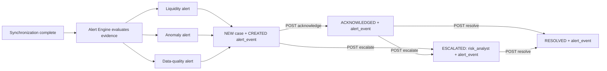

# Alert Engine

The Alert Engine is an internal Aggregator module. It runs after every simulation synchronization tick and creates liquidity, anomaly, and data-quality alerts. It does not execute financial actions or make fraud determinations.

## Lifecycle

## Owner routing

| Alert type | Initial owner role | Escalation owner role |
| --- | --- | --- |
| Liquidity | `field_officer` | `risk_analyst` when escalated |
| Anomaly | `provider_ops` | `risk_analyst` |
| Data quality | `provider_ops` | `risk_analyst` when escalated |

## Sample alerts and evidence

| Type | Safe alert summary | Example evidence |
| --- | --- | --- |
| Liquidity | “Shared cash reserve may run low around 5:20 PM.” | `current_balance`, `burn_rate_per_minute`, `minutes_to_shortage`, `top_contributors` |
| Anomaly | “Unusual bKash cash-out activity — requires review.” | `window_count`, `baseline_mean`, `z_score`, `unique_customers`, `sample_transaction_ids` |
| Data quality | “Nagad data feed delayed; estimates have lower confidence.” | `last_update_at`, `seconds_since_update`, `note` |

## Narratives

All alert narratives go through `app/services/llm.py`. The default `mock` mode uses deterministic evidence-backed templates and produces English, Bangla, and Banglish. Live LLM mode is deliberately disabled and requires explicit user approval before implementation or activation.
