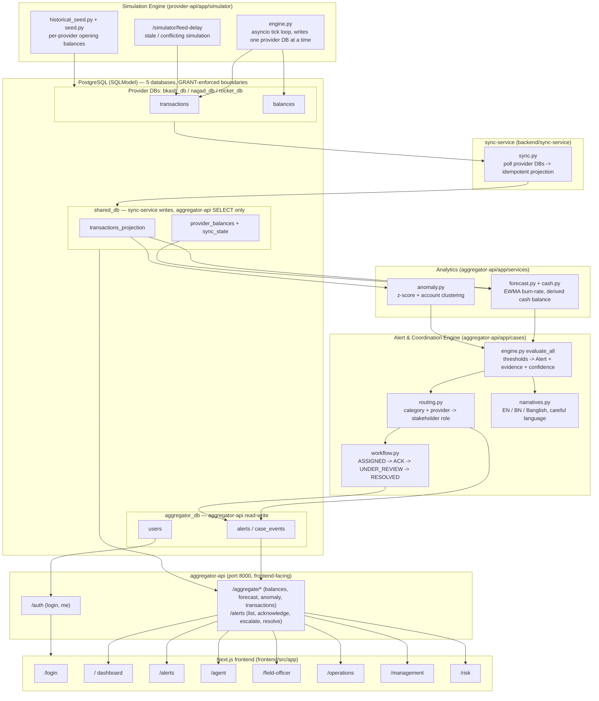

# Architecture

> v3 — updated to match the Docker Compose / Postgres multi-service stack (`provider-api`, `sync-service`, `aggregator-api`). Source diagram: [`docs/architecture.mmd`](architecture.mmd).

## System diagram

> Three Docker Compose services (`provider-api`, `sync-service`, `aggregator-api`) share one Postgres instance with five databases. The frontend talks only to `aggregator-api` on port 8000; `provider-api` and `sync-service` are internal. Real-time updates are polling-based (no WebSocket). Provider isolation is enforced at the Postgres `GRANT` layer — `aggregator-api` has no provider DB credentials and can only `SELECT` from `shared_db`.

## Component notes

- **Provider boundary**: bKash, Nagad, and Rocket each have their own physically separate Postgres database (`bkash_db`, `nagad_db`, `rocket_db`). `provider-api` holds one credential per provider and can only connect to its own database; `sync-service` is the only other role that can read provider data (read-only). `aggregator-api` has no provider DB connection string at all — it reads the sync projection in `shared_db` only. No code path converts or transfers value between providers.
- **Sync projection**: `sync-service` polls each provider database and idempotently projects new transactions and current balances into `shared_db` (`transactions_projection`, `provider_balances`, `sync_state`). It is the sole writer to `shared_db`; `aggregator-api` reads via a separate `shared_service` role with `SELECT` only.
- **Simulation Engine**: `provider-api` is the only source of provider transactions/balances (no real provider APIs are called). The simulator writes into exactly one provider database per tick via `session_for(provider)`. Scenario presets (normal, Eid spike, feed delay, etc.) are parameter sets fed into the same generator.
- **Analytics**: pure functions over `shared_db` projections — EWMA forecasting (`forecast.py`), derived cash balance (`cash.py`), and rule-based anomaly detection (`anomaly.py`: z-score + account clustering). Deterministic, unit-testable, no external calls.
- **Alert & Coordination Engine**: background loop in `aggregator-api` evaluates all agents, writes `Alert` + `CaseEvent` rows to `aggregator_db`. Routing table maps alert category + provider → stakeholder role. Case workflow: `ASSIGNED` → `ACKNOWLEDGED` → `UNDER_REVIEW` → `{MONITORING, ESCALATED, RESOLVED}` → `CLOSED`.
- **Narrative templates**: parameterized strings per alert type/language (`narratives.py`), filled with evidence values computed upstream — templates never invent evidence, they only phrase it.
- **API layer**: `aggregator-api` is the only frontend-facing service. Stateless REST only; the frontend polls. Routers: `/auth`, `/aggregate/*`, `/alerts`. Cash balance is derived from transaction history (not stored in a provider DB). The frontend never talks to `provider-api` or `sync-service` directly.
- **Frontend**: role-oriented pages under `frontend/src/app` — `/`, `/login`, `/agent`, `/field-officer`, `/alerts`, `/operations`, `/management`, `/risk` — mapped to the `UserRole` enum.
- **Auth**: `User` table in `aggregator_db`, JWT bearer tokens (`aggregator-api/app/auth/`), issued via `POST /auth/login`. Accounts are predetermined/seeded only — no self-registration. Every API route (except `/health`, `/auth/login`) requires a valid token, with per-role data scoping enforced server-side (see `docs/CREDENTIALS.md`).

## Provider boundary & real-world integration limits

This prototype represents bKash/Nagad/Rocket as three logically separate simulated systems sharing one physical cash observation point. It does not integrate with, authenticate against, or move value through any real provider API. "Unified view" means *read-side aggregation for display and analytics only* — never a merged balance, shared ledger, or cross-provider settlement. This boundary is enforced at the Postgres permission layer (separate databases, restricted roles) and at the data model level (no cross-provider transfer operation exists in the codebase), and is called out explicitly in `docs/RESPONSIBLE_DESIGN.md`.
