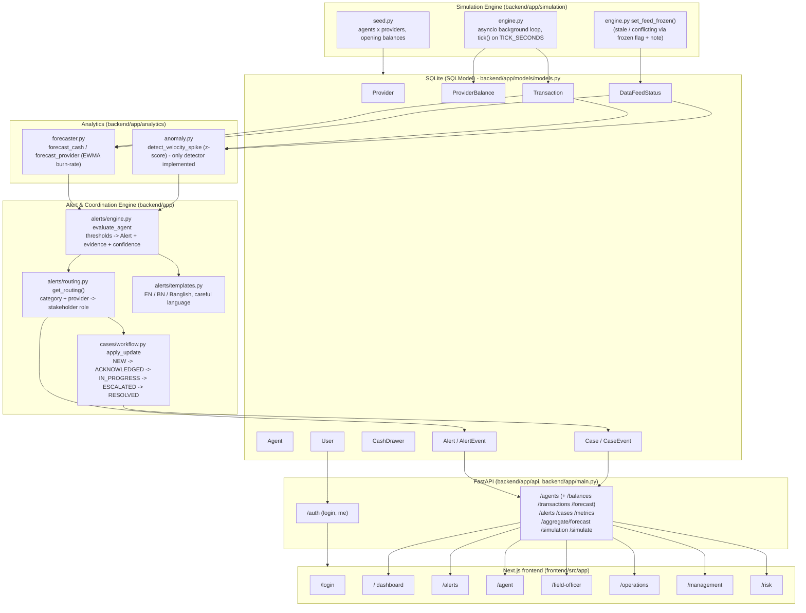

# Architecture

> v2 — updated after Pass 2 to match the code as it actually stands (see `git log` for history). Update this diagram and the component notes at the end of each pass as pieces land.

## System diagram

> No WebSocket route exists in the backend (no `/ws/live` anywhere under `backend/app`) — real-time updates are polling-based only. The frontend has no `/cases/[id]`, `/scenarios`, or `/metrics` pages; it is organized around role-based routes matching the `UserRole` enum (AGENT, FIELD_OFFICER, AREA_MANAGER, PROVIDER_OPS, RISK_COMPLIANCE, MANAGEMENT) rather than the feature-based pages originally planned.

## Component notes

- **Provider boundary**: `ProviderBalance` rows are keyed by `(agent_id, provider_id)` and are never summed into a single "combined wallet" value in storage — only displayed side by side. `Provider` is a first-class table (not an enum), so bKash/Nagad/Rocket are real rows, not hardcoded strings. No code path converts or transfers value between providers.
- **Validation & metrics**: the `/metrics` endpoint reports proxy metrics for sync latency, forecast lead time, anomaly precision/recall, alert explanation coverage, and per-provider sync health so the demo can show operational evidence without pretending to be a production observability stack.
- **Simulation Engine**: the only source of transactions/balances (no real provider APIs are called, per challenge constraints). Scenario presets (A–D from the brief, see `simulation/profiles.py`) are parameter sets fed into the same generator, not special-cased code paths — this keeps the demo and the "real" logic identical.
- **Analytics**: pure functions over `Transaction`/`ProviderBalance`/`DataFeedStatus` history — deterministic, unit-testable, no external calls. Currently only `detect_velocity_spike` is implemented in `anomaly.py`; near-identical-amount, balance-reconciliation, and cross-provider-linkage detectors are not yet built (tracked as future work, not implemented). This is what satisfies the "use AI/analytics meaningfully" requirement without any LLM dependency.
- **Alert & Coordination Engine**: the only place that writes `Alert`/`AlertEvent`/`Case`/`CaseEvent` rows (`AlertEvent` is an audit log for alert state changes, parallel to `CaseEvent`). Routing table is a static, documented mapping (alert category + provider → stakeholder role) — explicit and auditable rather than implicit. Case workflow states are `NEW`, `ACKNOWLEDGED`, `IN_PROGRESS`, `ESCALATED`, `RESOLVED` (see `CaseStatus` in `models.py`).
- **Narrative templates**: parameterized strings per alert type/language, filled with evidence values computed upstream — templates never invent evidence, they only phrase it.
- **API layer**: stateless REST only — there is no WebSocket route in the backend; the frontend polls. Routers: `/auth`, `/agents` (with `/agents/{id}/balances`, `/agents/{id}/transactions`, `/agents/{id}/forecast` nested under it, not standalone), `/alerts`, `/cases`, `/metrics`, `/aggregate/forecast`, `/simulation`, `/simulate`. All endpoints read from the same DB the analytics/alert engines write to, so the frontend never talks to the simulation directly.
- **Frontend**: role-oriented pages under `frontend/src/app` — `/`, `/login`, `/agent`, `/field-officer`, `/alerts`, `/operations`, `/management`, `/risk` — mapped to the `UserRole` enum rather than a feature-based page list, matching the brief's distinct stakeholder needs (Section 5).
- **Auth**: backed by a `User` table (`backend/app/models/models.py`) and JWT bearer tokens (`backend/app/core/security.py`, `backend/app/core/deps.py`), issued via `POST /auth/login`. Accounts are predetermined/seeded only (`backend/app/simulation/seed.py`) — no self-registration and no customer login, per Section 5. Every API route (except `/`, `/health`, `/auth/login`) requires a valid token, and each role's data/case-mutation access is scoped server-side (see `docs/CREDENTIALS.md` for the account list and per-role rules).

## Provider boundary & real-world integration limits

This prototype represents bKash/Nagad/Rocket as three logically separate simulated systems sharing one physical cash observation point. It does not integrate with, authenticate against, or move value through any real provider API. "Unified view" means *read-side aggregation for display and analytics only* — never a merged balance, shared ledger, or cross-provider settlement. This boundary is enforced at the data model level (separate `ProviderBalance` rows, no cross-provider transfer operation exists in the codebase) and is called out explicitly in `docs/RESPONSIBLE_DESIGN.md` (added Pass 2).
